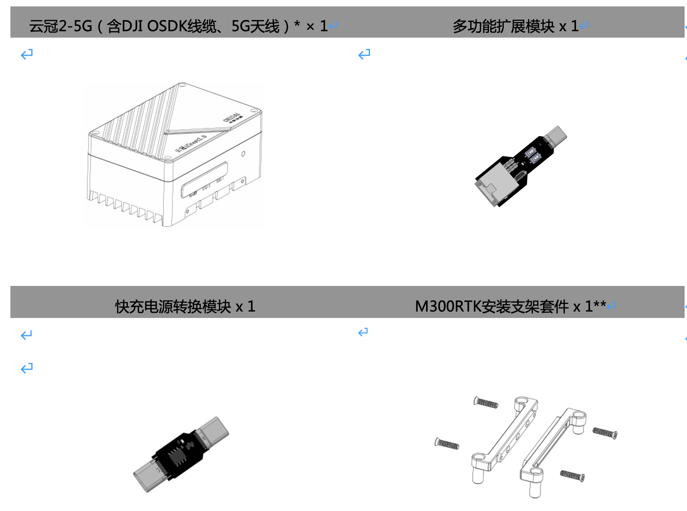

# 产品概览

## Icrest3是什么？

---

Icrest3是专为 无人机开发者打造的第三代微型计算机，搭载 NVIDIA Jetson Xavier NX 模块，
可更加快速地完成复杂的图形处理工作，同时具备 5G 远程网联、1.4GHz MESH去中心化组网、WIFI6网络连接功能。内置IcrestSDK，可以实现开源QGC地面站控制大疆行业无人机和AI模型快速部署。 Icrest3系列提供多种接口以连接不同的外部设备，适配大疆M3行业版、M30系列、经纬M300RTK和PX4等开源飞控系统等设备，
拥有更强的灵活性与扩展性，同时为用户提供丰富便捷的开发途径。

## 物品清单

------

## 预装软件
------

Icrest3预装了以下软件，用户可根据使用需求安装其他软件。

|             | Icrest3-5G |      |
|-------------| ---------- | ---- |
| Jepack4.5   | ✅          |      |
| Ubuntu18.04 |            |      |
| CUDA10      |            |      |
| PSDK XXX    |            |      |
| MAVLINK XXX |            |      |
| ROS2        |            |      |
| ...         |            |      |

## 规格参数

---

| 型号         |       Icrest3-5G      |                         Icrest3-MESH                         |
|------------|:---------------------------------| :----------------------------------------------------------- |
| 重量         |                待定                |                             待定                             |
| 尺寸（不含无人机支架） |                待定                |                             待定                             |
| 处理器        |     NVIDIA Jetson Xavier NX      |                   NVIDIA Jetson Xavier NX                    |
| AI性能       |             21 TOPS              |                           21 TOPS                            |
| 内存         | 8GB 128-bit LPDDR4x @ 1600MHz \|51.2GB/s |                           8GB 128-bit LPDDR4x @ 1600MHz \|51.2GB/s                           |
| 存储         |            128GB SSD             |                          128GB SSD                           |
| 网络         | 5G NR、 千兆以太网JST接口、 WIFI6 | 2401.5-2481.5MHz/1427.9-1447.9MHz/806-826MHz、 千兆以太网JST接口 、 WIFI6 |
| USB        |  USB 3.1 (10Gbps) + USB 2.0 x 3  |                USB 3.1 (10Gbps) + USB 2.0 x 3                |
| 显示接口       |            Micro HDMI            |                          Micro HDMI                          |
| I/O        |      UART 接口 × 2、CAN接口 x 1      |                  UART 接口 × 2、CAN接口 x 1                  |
| 功率         |             10-25  W             |                             待定                             |
| 电源输入       |        12 - 56 V 电源接口 ×1         |                                                              |
| 工作温度       |            -25 至 50℃             |                          -25 至 50℃                          |
| 防护等级       |               IP45               |                             IP45                             |
